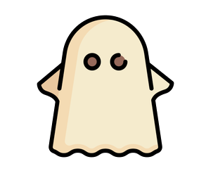

  

<h1 align="center">Hola, soy Ghops</h1>

  

---
### 🧠 Sobre mí

Soy Julian, un desarrollador junior con muchas ganas de crecer y seguir aprendiendo.

Me gusta involucrarme en proyectos donde pueda aportar, mejorar constantemente y adaptarme a distintos entornos, tecnologías o formas de trabajo. No tengo miedo de lo nuevo: lo veo como una oportunidad para evolucionar, tanto en lo técnico como en lo personal.

Estoy empezando mi camino en el desarrollo, pero tengo claro que el aprendizaje continuo, la colaboración y la flexibilidad son claves para construir soluciones reales y útiles.

Siempre estoy en busca de nuevos retos que me ayuden a mejorar y a sumar experiencia.

---

### 💡 Tecnologías principales

  
  
  
  
  

 ---

<h3 align="center"><i>La perfección está en los detalles</i></h3>

